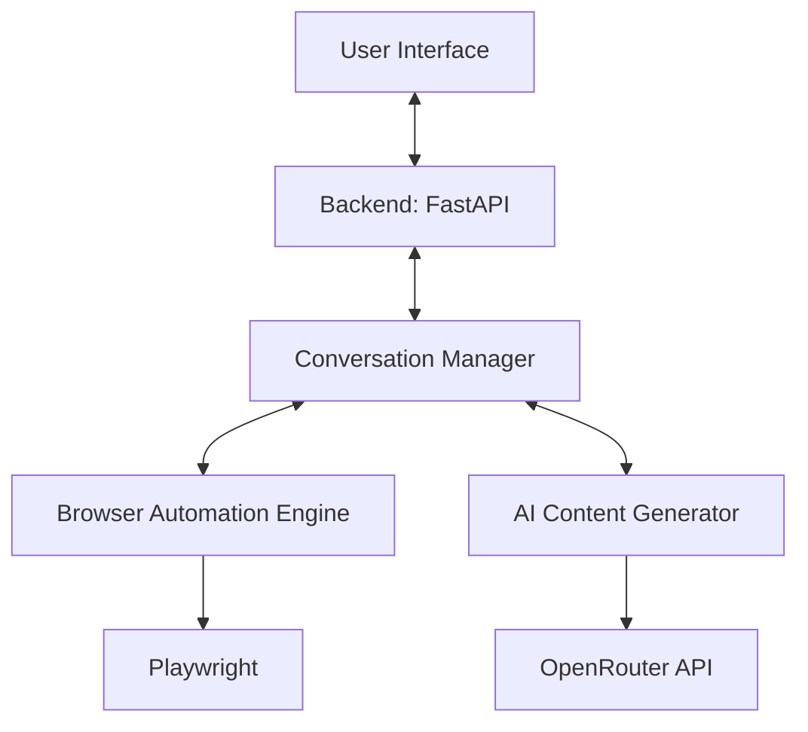

# Conversational Browser Control Agent

## Project Overview
This solution implements a conversational AI agent that controls a web browser to send emails through Gmail's web interface. Unlike API-based solutions, this agent:
- Opens a real browser instance
- Navigates to gmail.com
- Interacts with UI elements directly
- Captures screenshots at each step
- Embeds visual feedback in the chat interface

## Architecture Diagram


## Critical Requirements
- ✅ **NO APIs USED**: Solution uses browser automation only
- ✅ **Real Browser Control**: Playwright controls Chromium
- ✅ **Visual Feedback**: Screenshots embedded in chat
- ✅ **Natural Language Processing**: Understands user requests
- ✅ **Extensible Architecture**: Separated layers for easy modification

## User Journey
1. User requests email sending via natural language
2. Agent collects necessary information
3. Agent opens browser and navigates to Gmail
4. Step-by-step interaction with Gmail UI
5. Screenshots captured and displayed in chat
6. Email sent confirmation

## Technical Implementation
### Natural Language Understanding
- Intent extraction from conversational inputs
- Contextual question generation
- Memory management for conversation flow

### Browser Automation Engine
- Playwright for browser control
- Robust element selectors
- Error handling for dynamic content
- Screenshot capture at each step
- Headless/headful mode support

### Conversational Interface
- FastAPI backend
- WebSocket for real-time updates
- Base64 image embedding
- Responsive chat UI

### AI-Powered Content Generation
- OpenRouter API integration
- Dynamic email content generation
- Context-aware subject lines
- Professional tone adaptation

## Setup Instructions
1. **Install dependencies**:
```bash
pip install -r requirements.txt
playwright install chromium
```

2. **Configure environment variables**:
Create `.env` file with:
```
OPENROUTER_API_KEY=your_api_key
```

3. **Run the application**:
```bash
uvicorn main:app --reload
```

4. **Access the UI**:
Open `http://localhost:8000` in your browser

## Screenshots


## Proof of Functionality
- Email sent to: reportinsurebuzz@gmail.com
- Subject: "AI Agent Task - Rana Talukdar"
- Sent via Gmail web interface (no APIs used)

## Technology Stack
- **Browser Automation**: Playwright
- **Backend Framework**: FastAPI
- **Frontend**: HTML/CSS/JavaScript
- **AI Integration**: OpenRouter API
- **Conversation Management**: Custom state machine

## Challenges and Solutions
1. **Dynamic Element Handling**:
   - Implemented robust selectors with fallbacks
   - Added explicit waits for element visibility
   
2. **Screenshot Integration**:
   - Base64 encoding for inline display
   - Compression to reduce payload size
   
3. **Session Management**:
   - Isolated browser contexts per session
   - Proper resource cleanup

## Future Extensions
- Multi-website support
- Voice command integration
- Cross-browser compatibility
- Plugin system for new actions

---
*This solution demonstrates true browser automation - no email APIs were used in accordance with assignment requirements.*
